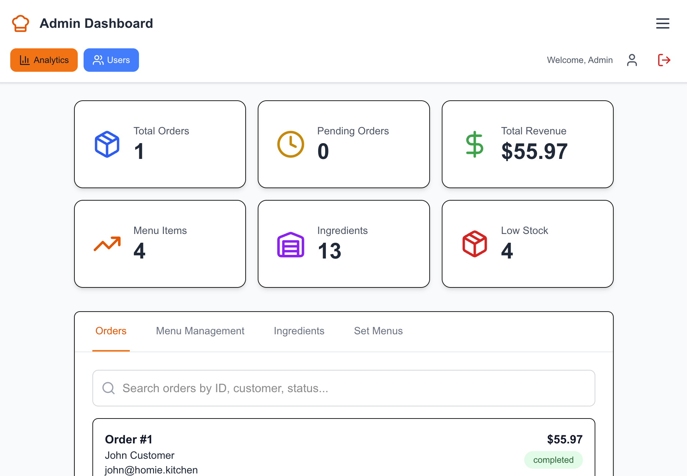

# Restaurant Management System

A modern restaurant management system built with Next.js, featuring user authentication, menu management, order processing, and inventory tracking.

## Features

- **User Authentication**: Admin and customer roles with secure login/register
- **Menu Management**: Add, edit, and manage menu items with availability status
- **Order Processing**: Real-time order tracking and status management
- **Inventory Management**: Track ingredients and stock levels
- **Responsive Design**: Modern UI that works on desktop and mobile

## Screenshots

### Main Login Page

### Admin Dashboard

### Customer Menu

## Quick Start

### Prerequisites

- Node.js 18+ 
- npm or yarn

### Default Login Credentials

**Admin Account:**
- Email: `admin@homie.kitchen`
- Password: `admin123`

**Staff Account**
- Email: `staff@homie.kitchen`
- Password: `staff123`

**Customer Account:**
- Register a new account or use any email/password combination

## API Documentation

See [ROUTE.md](./ROUTE.md) for detailed API endpoint documentation.

