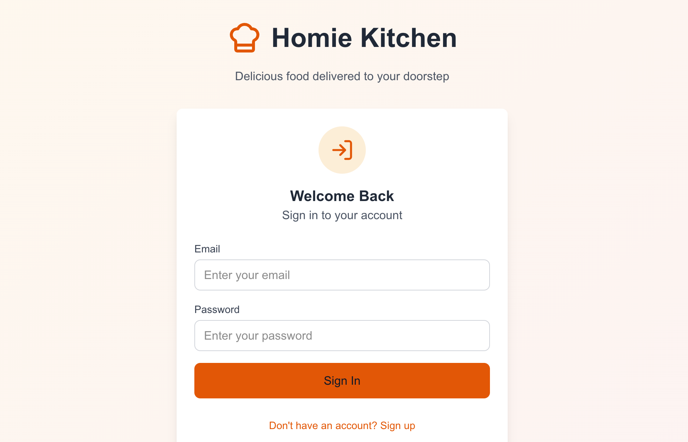
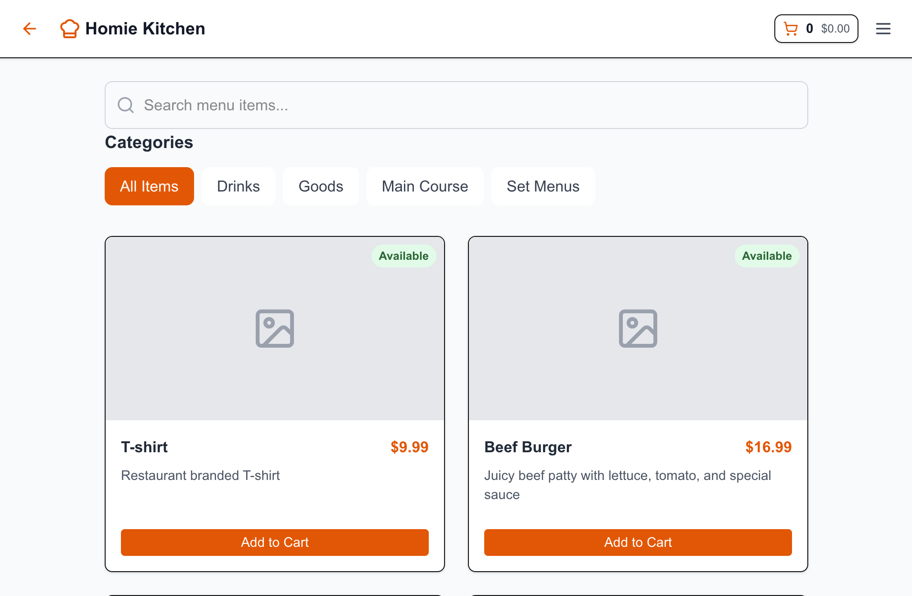

# Restaurant Management System

A modern restaurant management system built with Next.js, featuring user authentication, menu management, order processing, and inventory tracking.

## Features

- **User Authentication**: Staff and customer roles with secure login/register
- **Menu Management**: Add, edit, and manage menu items with availability status
- **Order Processing**: Real-time order tracking and status management
- **Inventory Management**: Track ingredients and stock levels
- **Responsive Design**: Modern UI that works on desktop and mobile

## Screenshots

### Main Login Page


### Staff Dashboard


### Customer Menu


## Quick Start

### Prerequisites

- Node.js 18+ 
- npm or yarn


### Default Login Credentials

**Staff Account:**
- Email: `staff@homie.kitchen`
- Password: `staff123`

**Customer Account:**
- Register a new account or use any email/password combination

## Project Structure

```
homie.kitchen/
├── src/
│   ├── app/
│   │   ├── api/           # API routes
│   │   ├── menu/          # Customer menu page
│   │   ├── orders/        # Order history page
│   │   ├── staff/         # Staff dashboard
│   │   └── page.js        # Main login page
│   └── lib/
│       ├── db.js          # Database configuration
│       └── utils.js       # Utility functions
├── public/                # Static assets
└── restaurant.db          # SQLite database
```

## API Documentation

See [ROUTE.md](./ROUTE.md) for detailed API endpoint documentation.

